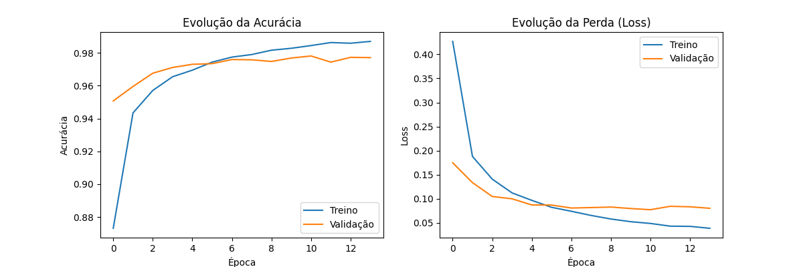
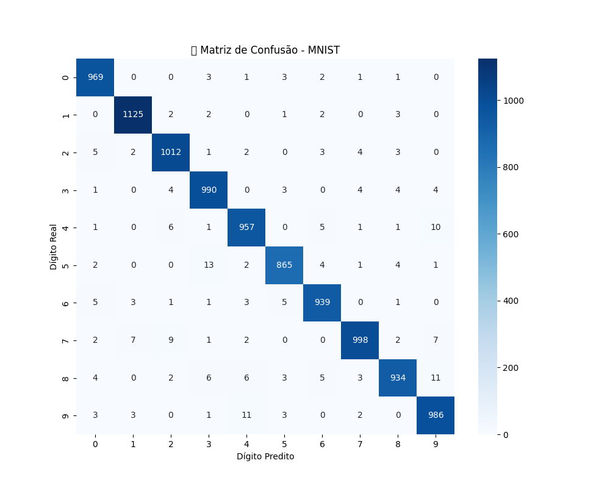

# 🧠 Classificador de Dígitos com Keras (MNIST)

[](https://www.python.org/)
[](https://www.tensorflow.org/)
[](https://keras.io/)

Este repositório é parte dos laboratórios práticos desenvolvidos na disciplina de Artificial Intelligence Development. Utilizando Keras e TensorFlow, treinamos redes neurais para classificar dígitos manuscritos do famoso dataset **MNIST**.

---

## 📂 Estrutura do Projeto

* **`Keras_Modelo_de_Classificação_com_MNIST.ipynb`**: Laboratório inicial focado na construção de Redes Neurais Densas (ANN) e fundamentos de processamento de tensores.
* **`Classificador_de_Dígitos_com_Keras_(MNIST).ipynb`**: Notebook avançado com implementação otimizada, incluindo Early Stopping, análise exploratória profunda e visualização de erros.
* **`imagens/`**: Diretório contendo as curvas de perda/acurácia e a matriz de confusão.
* **`requirements.txt`**: Lista de dependências para reprodução do ambiente.

---

## 🏗️ Arquitetura e Técnicas

O modelo consiste em uma Rede Neural Artificial (ANN) com a seguinte configuração:
- **Input Layer**: Flatten (converte imagem 28x28 em vetor de 784).
- **Hidden Layers**: Camadas Densas com ativação **ReLU** e **Dropout** (20%) para regularização e prevenção de overfitting.
- **Output Layer**: Camada Densa (10 neurônios) com ativação **Softmax**.
- **Otimização**: Implementação de **Early Stopping** monitorando a `val_loss` para restaurar os melhores pesos.

---

## 📊 Resultados Alcançados

* **Acurácia no Teste:** **97.75%**
* **Loss final (Validação):** **0.0743**
* **Convergência:** Treinamento otimizado finalizado em **14 épocas**.
* **Performance:** A matriz de confusão demonstra alta precisão, validando a eficácia do modelo em distinguir dígitos similares e tratar casos de grafia ambígua.

---

### 📈 Gráficos de Desempenho

Abaixo, a evolução do treinamento demonstrando a estabilização da perda e o crescimento da acurácia:




---

## ☁️ Guia de Deploy
Conforme minha metodologia de projetos, este modelo foi estruturado para integração em nuvem:

1.  **Exportação:** O modelo é salvo no formato `.h5` ou `.keras` (ex: `mnist_model.h5`).
2.  **Containerização:** O projeto inclui suporte para **Docker** para isolamento de dependências.
3.  **Sugestão de Deploy:** Utilização de **AWS Lambda** ou **Google Cloud Functions** para servir o modelo via API serverless.

---

## 🏁 Como executar

```bash
# 1. Clone o repositório
git clone [https://github.com/CarlossAlexandree/mnist-keras-classifier.git](https://github.com/CarlossAlexandree/mnist-keras-classifier.git)

# 2. Instale as dependências
pip install -r requirements.txt

# 3. Execute o Notebook
jupyter notebook